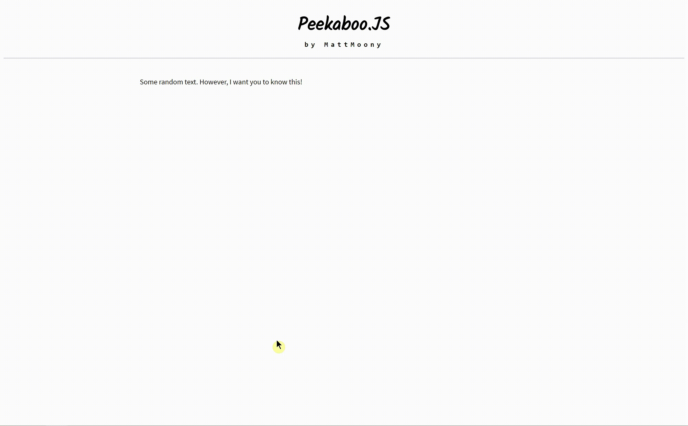

    

# PeekabooJS
_Where's the info? There's the info!_

---

Add necessary information to your HTML-Elements. Watch the information magically appear in a little info-popup pointing to the element-in-question. It is an interesting way to gain the user's attention and give him additional intel.

## Installation

#### Script tag

```html
<script src='https://cdn.jsdelivr.net/gh/MattMoony/PeekabooJS@master/src/peekaboo.js'></script>
```

## Setup

No additional setup required. All you have to do is include the script in your HTML document.

## Usage

#### Parse all

In order to have a _peekaboo-popup_ appear, whenever a user hovers over a certain element, you just need to use the `<pab></pab>` HTML tag around any text/element.

To specify the information that will show up, use the `info` attribute.

```html
<!-- ... -->

<p>
  Some random text.
  However, I want you to know <pab info="Hello World!">this</pab>!
</p>

<!-- ... -->
```

Now, just creating the element doesn't create a popup just yet. However, all you need to do now, is, to call the `Peekaboo.parse()` function in your JavaScript code.

```javascript
// ...

Peekaboo.parse();

// ...
```



#### Parse children

If you decide to asynchronosly load content into your page, or for any other reason, you might only want to parse certain parts of the webpage. You can do this by just passing the parent element, whose children should be parsed, to the `Peekaboo.parse(parent)` function.

```html
<!-- ... -->

<div>
  something, something
</div>
<div id="parent">
  <p>
    Some random text.
    However, I want you to
    know <pab info="Hello World!">this</pab>!
  </p>
</div>

<!-- ... -->
```

```javascript
// ...

Peekaboo.parse(document.getElementById('parent'));

// ...
```

#### Reposition

In order for the info-popups to always be in the right position, you should call the `Peekaboo.reposition()` which will re-align all, already created, _peeker_ elements.

```javascript
// ...

window.onresize = () => {
  Peekaboo.reposition();

  // ...
}

// ...
```

## Conclusion

For any further questions & suggestions, you can message me on [twitter](https://twitter.com/Matthia23184857).

---

_... Matthias M. (March, 2019)_
